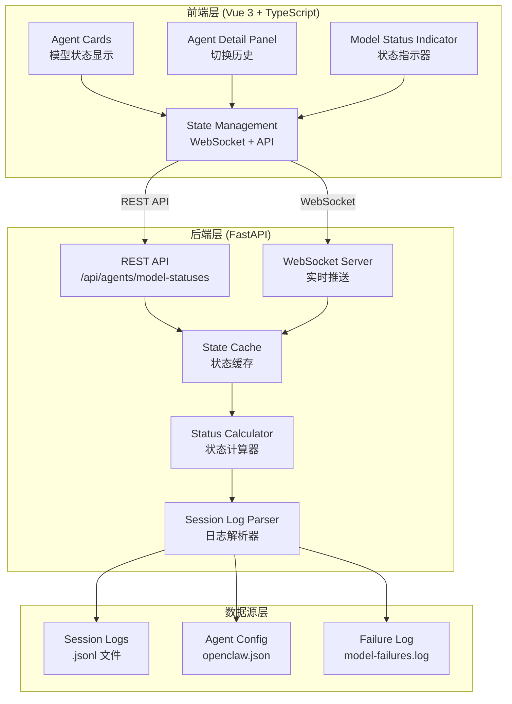
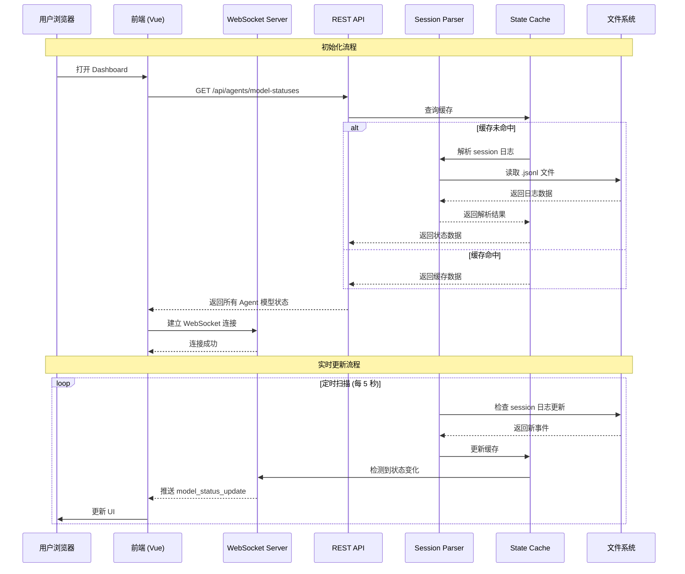
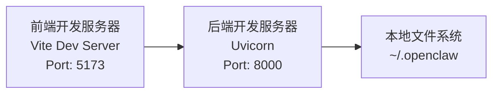
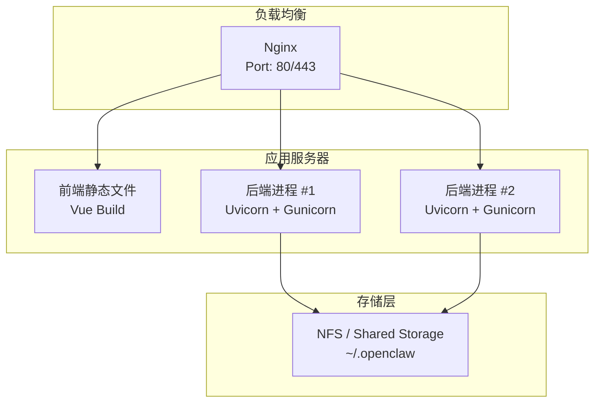

# 协作流程模型状态动态显示 - 技术架构设计

## 文档信息

- **创建日期**: 2026-02-27
- **版本**: 1.0
- **基于需求分析**: `collaboration-model-status-analysis.md`

---

## 1. 架构概览

### 1.1 设计目标

基于协作流程模型状态动态显示需求，设计一个**可扩展、可维护、高性能**的技术架构，实现：

1. **实时性**: 模型状态变化在 1 秒内反映到 UI
2. **可靠性**: 降级策略，WebSocket 失败时自动切换到轮询
3. **可扩展性**: 支持未来新增模型状态类型和监控指标
4. **可维护性**: 清晰的模块边界和职责划分

### 1.2 核心架构原则

1. **关注点分离**: 前端负责 UI 渲染，后端负责数据聚合和状态计算
2. **渐进增强**: 基础功能优先，高级功能逐步实现（Phase 1-4）
3. **性能优先**: 避免重复解析 session 日志，使用缓存和增量更新
4. **错误容忍**: 降级策略，部分功能失败不影响整体可用性

---

## 2. 系统架构

### 2.1 整体架构图



### 2.2 模块职责

#### 前端模块

| 模块 | 职责 | 技术栈 |
|------|------|--------|
| **Agent Cards** | 显示 Agent 模型状态、切换历史入口 | Vue 3 组件 |
| **Agent Detail Panel** | 详细的模型状态、切换历史列表 | Vue 3 组件 |
| **Model Status Indicator** | 可复用的状态指示器组件 | Vue 3 组件 |
| **State Management** | 管理 WebSocket 连接、API 请求、本地状态缓存 | Composition API + WebSocket |

#### 后端模块

| 模块 | 职责 | 技术栈 |
|------|------|--------|
| **REST API** | 提供模型状态查询接口 | FastAPI + Pydantic |
| **WebSocket Server** | 实时推送模型状态变化 | FastAPI WebSocket |
| **Session Log Parser** | 解析 session 日志，提取模型信息 | Python + json |
| **State Cache** | 缓存解析结果，避免重复读取 | Python Dict + TTL |
| **Status Calculator** | 计算模型状态（healthy/error/cooldown/disabled） | Python 逻辑 |

---

## 3. 数据流架构

### 3.1 完整数据流图



### 3.2 数据流详细说明

#### 3.2.1 初始化流程

1. **前端请求**: Vue 组件挂载时，调用 `GET /api/agents/model-statuses`
2. **缓存查询**: 后端首先查询 State Cache
3. **解析日志**（如果缓存未命中）:
   - 扫描 `~/.openclaw/agents/{agentId}/sessions/*.jsonl`
   - 提取最近的 `model-snapshot` 和 `message` 事件
   - 解析 `model_change` 事件构建切换历史
   - 从 `model-failures.log` 提取错误信息
4. **状态计算**: 根据 last_call 和 last_error 计算模型状态
5. **返回响应**: 将聚合后的状态数据返回前端
6. **WebSocket 连接**: 前端建立 WebSocket 连接，准备接收实时更新

#### 3.2.2 实时更新流程

1. **定时扫描**: 后端每 5 秒扫描一次 session 日志（可通过环境变量配置）
2. **增量解析**: 只解析上次扫描后新增的日志行
3. **状态检测**: 对比缓存中的状态，检测是否发生变化
4. **广播推送**: 如果状态变化，通过 WebSocket 广播给所有连接的客户端
5. **前端更新**: 前端接收到推送，更新本地状态和 UI

#### 3.2.3 降级策略

如果 WebSocket 连接失败：

1. **自动降级**: 前端检测到 WebSocket 连接失败
2. **切换轮询**: 启动定时器，每 5 秒调用 `GET /api/agents/model-statuses`
3. **重连机制**: 每隔 30 秒尝试重新建立 WebSocket 连接
4. **成功恢复**: WebSocket 连接成功后，停止轮询

---

## 4. 模块设计

### 4.1 后端模块详细设计

#### 4.1.1 Session Log Parser

**职责**: 解析 session 日志，提取模型相关信息

**输入**:
- Session 文件路径: `~/.openclaw/agents/{agentId}/sessions/{sessionId}.jsonl`
- 解析范围: 最近 N 行或最近 T 时间段

**输出**:
```python
class ParsedModelData:
    agent_id: str
    current_model: str              # 当前使用的模型
    model_snapshots: List[ModelSnapshot]
    model_changes: List[ModelChange]
    messages: List[Message]
    errors: List[ModelError]
```

**核心方法**:

```python
class SessionLogParser:
    def parse_session_file(self, session_path: Path) -> ParsedModelData:
        """解析单个 session 文件"""
        pass
    
    def parse_last_n_lines(self, session_path: Path, n: int = 1000) -> List[Dict]:
        """从文件末尾读取最后 N 行（性能优化）"""
        pass
    
    def extract_current_model(self, parsed_data: ParsedModelData) -> str:
        """提取当前使用的模型"""
        pass
    
    def extract_switch_history(self, parsed_data: ParsedModelData) -> List[ModelSwitchEvent]:
        """提取模型切换历史"""
        pass
    
    def infer_switch_reason(self, change: ModelChange, errors: List[ModelError]) -> SwitchReason:
        """推断切换原因"""
        pass
```

**性能优化**:
- 使用 `tail -n` 或从文件末尾读取，避免全量读取
- 缓存已解析的文件大小，下次只解析新增部分
- 使用 `watchdog` 监听文件变化，只在文件更新时解析

#### 4.1.2 Status Calculator

**职责**: 计算模型状态（healthy/error/cooldown/disabled）

**输入**:
- Agent ID
- Model ID
- 最近调用记录
- 最近错误记录

**输出**:
```python
class ModelStatus:
    model_id: str
    provider: str
    status: 'healthy' | 'error' | 'cooldown' | 'disabled'
    last_used_at: Optional[int]
    last_error: Optional[ModelError]
    cooldown_until: Optional[int]
```

**核心逻辑**:

```python
class StatusCalculator:
    def calculate_model_status(
        self, 
        agent_id: str, 
        model_id: str,
        last_call: Optional[ModelCall],
        last_error: Optional[ModelError]
    ) -> ModelStatus:
        """
        状态计算规则:
        1. 如果没有调用记录且没有错误 → healthy（从未使用）
        2. 如果最后调用时间 > 最后错误时间 → healthy
        3. 如果最后错误时间 > 最后调用时间:
           - 429 错误 → error (rate_limit)
           - timeout 错误 → error (timeout)
           - auth 错误 → error (auth_failed)
        4. 如果连续多次 429 错误（>3次，且在最近 10 分钟）→ disabled
        5. 如果切换到 fallback 且 primary 没有调用 → cooldown（推断）
        """
        pass
```

#### 4.1.3 State Cache

**职责**: 缓存解析结果，避免重复解析

**缓存结构**:

```python
class StateCache:
    # agent_id -> AgentModelStatus
    cache: Dict[str, AgentModelStatus]
    
    # 最后更新时间
    last_update: Dict[str, int]
    
    # TTL（Time To Live）- 5 分钟
    ttl: int = 300
```

**核心方法**:

```python
class StateCache:
    def get(self, agent_id: str) -> Optional[AgentModelStatus]:
        """获取缓存（如果未过期）"""
        pass
    
    def set(self, agent_id: str, status: AgentModelStatus):
        """设置缓存"""
        pass
    
    def invalidate(self, agent_id: str):
        """清除缓存"""
        pass
    
    def cleanup_expired(self):
        """清理过期缓存"""
        pass
```

**缓存策略**:
- TTL: 5 分钟
- 增量更新: 只更新变化的 Agent
- 失效策略: 检测到 session 文件修改时失效

#### 4.1.4 REST API 设计

##### GET /api/agents/model-statuses

**功能**: 获取所有 Agent 的模型状态

**响应**:
```json
{
  "agents": [
    {
      "agentId": "main",
      "agentName": "老 K (Project Manager)",
      "config": {
        "primary": "zhipu/glm-4.5",
        "fallbacks": ["zhipu/glm-4.7", "zhipu/glm-5"]
      },
      "currentModel": {
        "modelId": "zhipu/glm-5",
        "provider": "zhipu",
        "status": "healthy",
        "lastUsedAt": 1709001234567,
        "lastError": null
      },
      "allModels": [
        {
          "modelId": "zhipu/glm-4.5",
          "provider": "zhipu",
          "status": "error",
          "lastUsedAt": 1709001000000,
          "lastError": {
            "type": "rate_limit",
            "message": "Rate limit exceeded",
            "timestamp": 1709001000000,
            "code": 429
          }
        },
        {
          "modelId": "zhipu/glm-4.7",
          "provider": "zhipu",
          "status": "healthy",
          "lastUsedAt": 1709001100000
        },
        {
          "modelId": "zhipu/glm-5",
          "provider": "zhipu",
          "status": "healthy",
          "lastUsedAt": 1709001234567
        }
      ],
      "switchHistory": [
        {
          "id": "switch-001",
          "agentId": "main",
          "fromModel": "zhipu/glm-4.5",
          "toModel": "zhipu/glm-4.7",
          "reason": "rate_limit",
          "timestamp": 1709001000000,
          "time": "09:45:35"
        }
      ],
      "authProfile": {
        "profileId": "zhipu:default",
        "provider": "zhipu",
        "mode": "api_key",
        "status": "active"
      }
    }
  ],
  "lastUpdate": 1709001234567
}
```

##### GET /api/agents/{agentId}/model-switches?limit=20

**功能**: 获取指定 Agent 的模型切换历史

**响应**:
```json
{
  "agentId": "main",
  "agentName": "老 K (Project Manager)",
  "switches": [
    {
      "id": "switch-001",
      "agentId": "main",
      "fromModel": "zhipu/glm-4.5",
      "toModel": "zhipu/glm-4.7",
      "reason": "rate_limit",
      "timestamp": 1709001000000,
      "time": "09:45:35"
    }
  ],
  "total": 1
}
```

#### 4.1.5 WebSocket 消息设计

##### 消息类型

**1. model_status_update** - 模型状态更新

```json
{
  "type": "model_status_update",
  "data": {
    "agentId": "main",
    "modelStatus": {
      "modelId": "zhipu/glm-5",
      "provider": "zhipu",
      "status": "healthy",
      "lastUsedAt": 1709001234567
    },
    "timestamp": 1709001234567
  }
}
```

**2. model_switch_event** - 模型切换事件

```json
{
  "type": "model_switch_event",
  "data": {
    "agentId": "main",
    "switchEvent": {
      "id": "switch-001",
      "agentId": "main",
      "fromModel": "zhipu/glm-4.5",
      "toModel": "zhipu/glm-4.7",
      "reason": "rate_limit",
      "timestamp": 1709001000000,
      "time": "09:45:35"
    },
    "timestamp": 1709001234567
  }
}
```

**3. model_error** - 模型错误事件

```json
{
  "type": "model_error",
  "data": {
    "agentId": "main",
    "modelId": "zhipu/glm-4.5",
    "error": {
      "type": "rate_limit",
      "message": "Rate limit exceeded",
      "timestamp": 1709001000000,
      "code": 429
    },
    "timestamp": 1709001234567
  }
}
```

### 4.2 前端模块详细设计

#### 4.2.1 State Management

**职责**: 管理 WebSocket 连接、API 请求、本地状态缓存

**使用 Composition API**:

```typescript
// useModelStatus.ts
export function useModelStatus() {
  const modelStatuses = ref<AgentModelStatus[]>([])
  const wsConnected = ref(false)
  const lastUpdate = ref<number>(0)
  
  // WebSocket 连接
  const ws = ref<WebSocket | null>(null)
  
  // 初始化
  onMounted(async () => {
    // 1. 加载初始数据
    await fetchModelStatuses()
    
    // 2. 建立 WebSocket 连接
    connectWebSocket()
  })
  
  // 获取模型状态
  async function fetchModelStatuses() {
    const response = await fetch('/api/agents/model-statuses')
    const data = await response.json()
    modelStatuses.value = data.agents
    lastUpdate.value = data.lastUpdate
  }
  
  // WebSocket 连接
  function connectWebSocket() {
    ws.value = new WebSocket('ws://localhost:8000/ws')
    
    ws.value.onopen = () => {
      wsConnected.value = true
    }
    
    ws.value.onmessage = (event) => {
      const message = JSON.parse(event.data)
      handleMessage(message)
    }
    
    ws.value.onclose = () => {
      wsConnected.value = false
      // 降级到轮询
      startPolling()
    }
  }
  
  // 处理 WebSocket 消息
  function handleMessage(message: any) {
    switch (message.type) {
      case 'model_status_update':
        updateModelStatus(message.data)
        break
      case 'model_switch_event':
        addSwitchEvent(message.data)
        break
      case 'model_error':
        updateModelError(message.data)
        break
    }
  }
  
  // 降级轮询
  function startPolling() {
    const interval = setInterval(async () => {
      await fetchModelStatuses()
      
      // 尝试重连 WebSocket
      if (!wsConnected.value) {
        connectWebSocket()
      } else {
        clearInterval(interval)
      }
    }, 5000)
  }
  
  return {
    modelStatuses,
    wsConnected,
    lastUpdate,
    fetchModelStatuses
  }
}
```

#### 4.2.2 组件设计

##### AgentCard.vue 扩展

**新增 Props**:
```typescript
interface Props {
  agentId: string
  agentName: string
  status: string
  modelStatus?: AgentModelStatus  // 新增
}
```

**新增 UI 元素**:
- 模型状态指示器（healthy/error/cooldown/disabled）
- 切换历史展开/折叠按钮
- 切换历史列表（展开时显示）

##### ModelStatusIndicator.vue

**功能**: 可复用的模型状态指示器

**Props**:
```typescript
interface Props {
  status: 'healthy' | 'error' | 'cooldown' | 'disabled'
  modelId: string
  lastUsedAt?: number
  lastError?: ModelError
  compact?: boolean  // 紧凑模式（只显示图标）
}
```

**样式**:
```css
.status-healthy { color: #10b981; background: #d1fae5; }
.status-error { color: #f59e0b; background: #fef3c7; }
.status-cooldown { color: #3b82f6; background: #dbeafe; }
.status-disabled { color: #ef4444; background: #fee2e2; }
```

##### ModelSwitchHistory.vue

**功能**: 模型切换历史列表

**Props**:
```typescript
interface Props {
  agentId: string
  switches: ModelSwitchEvent[]
  limit?: number  // 限制显示数量
}
```

---

## 5. 实现策略

### 5.1 Phase 1: 基础状态显示（高优先级）

**目标**: 显示当前使用的模型和基本状态

**后端任务**:

1. **创建新模块** `src/backend/api/model_status.py`:
   ```python
   router = APIRouter()
   
   @router.get("/agents/model-statuses")
   async def get_model_statuses():
       # 实现逻辑
       pass
   
   @router.get("/agents/{agent_id}/model-status")
   async def get_model_status(agent_id: str):
       # 实现逻辑
       pass
   ```

2. **创建 Session Parser** `src/backend/data/session_parser.py`:
   - 实现 `parse_session_file()`
   - 实现 `extract_current_model()`
   - 性能优化：只读取最后 N 行

3. **创建 Status Calculator** `src/backend/status/model_status_calculator.py`:
   - 实现 `calculate_model_status()`
   - 实现 healthy/error 状态判断

4. **创建 State Cache** `src/backend/data/state_cache.py`:
   - 实现缓存读写
   - 实现 TTL 过期清理

**前端任务**:

1. **创建 Composition API** `src/frontend/composables/useModelStatus.ts`:
   - 实现 `fetchModelStatuses()`
   - 实现本地状态管理

2. **创建组件** `src/frontend/components/ModelStatusIndicator.vue`:
   - 实现状态指示器 UI
   - 实现不同状态的样式

3. **扩展 AgentCard.vue**:
   - 添加 `modelStatus` prop
   - 显示当前模型和状态

**预估工作量**: 2-3 小时

### 5.2 Phase 2: 切换历史（中优先级）

**目标**: 显示模型切换历史

**后端任务**:

1. **扩展 Session Parser**:
   - 实现 `extract_switch_history()`
   - 实现 `infer_switch_reason()`

2. **新增 API** `GET /api/agents/{agentId}/model-switches`:
   - 返回切换历史列表

**前端任务**:

1. **创建组件** `src/frontend/components/ModelSwitchHistory.vue`:
   - 实现切换历史列表 UI
   - 实现颜色编码（不同原因不同颜色）

2. **扩展 AgentCard.vue**:
   - 添加"切换历史"展开/折叠按钮
   - 点击展开显示切换历史

**预估工作量**: 3-4 小时

### 5.3 Phase 3: 实时更新（中优先级）

**目标**: 通过 WebSocket 实时推送模型状态变化

**后端任务**:

1. **扩展 WebSocket** `src/backend/api/websocket.py`:
   - 添加 `broadcast_model_status_update()`
   - 添加 `broadcast_model_switch_event()`
   - 添加 `broadcast_model_error()`

2. **创建定时任务** `src/backend/tasks/session_watcher.py`:
   - 每 5 秒扫描 session 日志
   - 检测状态变化并广播

**前端任务**:

1. **扩展 useModelStatus.ts**:
   - 实现 WebSocket 连接
   - 实现消息处理
   - 实现降级轮询

**预估工作量**: 4-5 小时

### 5.4 Phase 4: Auth Profile 和高级状态（低优先级）

**目标**: 显示 Auth Profile 和高级状态（cooldown/disabled）

**后端任务**:

1. **扩展 Status Calculator**:
   - 实现 cooldown 状态推断
   - 实现 disabled 状态推断

2. **扩展 API**:
   - 添加 Auth Profile 信息

**前端任务**:

1. **扩展 AgentDetailPanel.vue**:
   - 添加"模型状态" Tab
   - 显示 Auth Profile
   - 显示高级状态

**预估工作量**: 2-3 小时

---

## 6. 部署架构

### 6.1 开发环境



**配置**:
- 前端: `vite.config.ts` 代理到后端
- 后端: Uvicorn 单进程模式
- 数据: 直接访问本地文件系统

### 6.2 生产环境



**配置**:
- 前端: 构建静态文件，通过 Nginx 提供
- 后端: Gunicorn + Uvicorn workers (多进程)
- 数据: NFS 共享存储（如果多实例部署）

### 6.3 容器化部署（可选）

```dockerfile
# Dockerfile
FROM python:3.11-slim

WORKDIR /app

COPY src/backend/requirements.txt .
RUN pip install -r requirements.txt

COPY src/backend .

CMD ["gunicorn", "main:app", "-w", "4", "-k", "uvicorn.workers.UvicornWorker", "-b", "0.0.0.0:8000"]
```

```yaml
# docker-compose.yml
version: '3.8'
services:
  backend:
    build: .
    ports:
      - "8000:8000"
    volumes:
      - ~/.openclaw:/root/.openclaw:ro
  
  frontend:
    image: nginx:alpine
    ports:
      - "80:80"
    volumes:
      - ./frontend/dist:/usr/share/nginx/html
      - ./nginx.conf:/etc/nginx/nginx.conf
```

---

## 7. 监控和日志策略

### 7.1 日志策略

#### 后端日志

```python
# src/backend/utils/logger.py
import logging

logger = logging.getLogger("model_status")
logger.setLevel(logging.INFO)

# 日志格式
formatter = logging.Formatter(
    '%(asctime)s - %(name)s - %(levelname)s - %(message)s'
)

# 文件处理器
file_handler = logging.FileHandler('logs/model_status.log')
file_handler.setFormatter(formatter)
logger.addHandler(file_handler)

# 控制台处理器
console_handler = logging.StreamHandler()
console_handler.setFormatter(formatter)
logger.addHandler(console_handler)
```

**日志内容**:
- Session 解析开始/结束
- 状态变化检测
- WebSocket 连接/断开
- 错误和异常

#### 前端日志

```typescript
// src/frontend/utils/logger.ts
export const logger = {
  info: (message: string, data?: any) => {
    console.log(`[INFO] ${message}`, data)
  },
  error: (message: string, error?: any) => {
    console.error(`[ERROR] ${message}`, error)
  },
  warn: (message: string, data?: any) => {
    console.warn(`[WARN] ${message}`, data)
  }
}
```

### 7.2 性能监控

#### 关键指标

1. **API 响应时间**:
   - `GET /api/agents/model-statuses`: < 200ms
   - `GET /api/agents/{agentId}/model-switches`: < 100ms

2. **WebSocket 延迟**:
   - 状态变化到推送: < 1s
   - 推送到 UI 更新: < 100ms

3. **内存使用**:
   - State Cache: < 10MB
   - Session Parser: < 50MB

4. **CPU 使用**:
   - Session 解析: < 10% CPU（单核）
   - 定时扫描: < 5% CPU

#### 监控实现

```python
# src/backend/utils/metrics.py
from prometheus_client import Counter, Histogram, Gauge

# API 请求计数
api_requests_total = Counter(
    'api_requests_total',
    'Total API requests',
    ['method', 'endpoint', 'status']
)

# API 响应时间
api_response_time = Histogram(
    'api_response_time_seconds',
    'API response time',
    ['method', 'endpoint']
)

# WebSocket 连接数
ws_connections = Gauge(
    'websocket_connections',
    'Active WebSocket connections'
)

# State Cache 大小
cache_size = Gauge(
    'state_cache_size',
    'Number of items in state cache'
)
```

### 7.3 错误追踪

#### 错误类型

1. **Session 解析错误**:
   - JSON 解析失败
   - 文件读取失败
   - 权限错误

2. **WebSocket 错误**:
   - 连接失败
   - 发送失败
   - 超时

3. **API 错误**:
   - 404: Agent 不存在
   - 500: 内部错误

#### 错误处理

```python
# src/backend/utils/error_handler.py
from fastapi import HTTPException
from typing import Optional

class ModelStatusError(Exception):
    def __init__(self, message: str, code: Optional[int] = None):
        self.message = message
        self.code = code
        super().__init__(message)

async def handle_model_status_error(error: ModelStatusError):
    logger.error(f"Model status error: {error.message}", exc_info=True)
    
    if error.code == 404:
        raise HTTPException(status_code=404, detail=error.message)
    else:
        raise HTTPException(status_code=500, detail="Internal server error")
```

---

## 8. 性能优化

### 8.1 后端优化

1. **Session 解析优化**:
   - 只解析最后 N 行（如 1000 行）
   - 缓存已解析的文件大小，增量解析
   - 使用 `watchdog` 监听文件变化

2. **缓存策略**:
   - State Cache TTL: 5 分钟
   - 增量更新，只更新变化的 Agent
   - LRU 缓存淘汰策略

3. **并发处理**:
   - 使用异步 I/O 读取文件
   - 并发解析多个 session 文件

### 8.2 前端优化

1. **虚拟滚动**:
   - 如果切换历史很长，使用虚拟滚动
   - 只渲染可见区域的列表项

2. **防抖和节流**:
   - WebSocket 消息处理使用节流（100ms）
   - API 请求使用防抖（300ms）

3. **懒加载**:
   - 切换历史列表懒加载
   - AgentDetailPanel 懒加载

---

## 9. 可扩展性设计

### 9.1 新增状态类型

如果未来需要新增模型状态（如 `maintenance`、`deprecated`）:

1. **后端**: 扩展 `StatusCalculator` 的状态判断逻辑
2. **前端**: 扩展 `ModelStatusIndicator` 的样式
3. **数据结构**: 无需修改，使用字符串类型

### 9.2 新增监控指标

如果未来需要新增监控指标（如 `token_usage`、`latency`）:

1. **后端**: 扩展 `ParsedModelData` 数据结构
2. **API**: 扩展响应字段
3. **前端**: 扩展 UI 显示

### 9.3 多租户支持

如果未来需要支持多租户:

1. **数据隔离**: 每个租户独立的 session 目录
2. **API 扩展**: 添加 `tenant_id` 参数
3. **缓存隔离**: 每个租户独立的缓存命名空间

---

## 10. 风险和缓解策略

### 10.1 技术风险

| 风险 | 影响 | 缓解策略 |
|------|------|----------|
| Session 日志过大 | 解析性能下降 | 只解析最后 N 行，增量解析 |
| WebSocket 连接不稳定 | 实时性下降 | 降级到轮询，自动重连 |
| 文件权限错误 | 无法读取日志 | 错误提示，优雅降级 |
| 内存泄漏 | 长期运行性能下降 | 缓存 TTL，定期清理 |

### 10.2 业务风险

| 风险 | 影响 | 缓解策略 |
|------|------|----------|
| 状态判断不准确 | 用户误解 | 明确标注"推断状态"，提供详细信息 |
| 切换原因推断错误 | 调试困难 | 提供原始日志链接，支持手动标注 |
| 性能影响主流程 | Dashboard 卡顿 | 后台异步处理，不阻塞主线程 |

---

## 11. 总结

### 11.1 核心架构决策

1. **前后端分离**: 前端负责 UI 渲染，后端负责数据聚合和状态计算
2. **WebSocket + REST API**: REST API 提供初始数据，WebSocket 提供实时更新
3. **缓存策略**: State Cache 避免重复解析，TTL 保证数据新鲜度
4. **降级策略**: WebSocket 失败时自动切换到轮询
5. **渐进式实现**: Phase 1-4 逐步实现，降低风险

### 11.2 技术栈确认

- **前端**: Vue 3 + TypeScript + Vite
- **后端**: FastAPI + Pydantic + Uvicorn
- **实时通信**: WebSocket
- **缓存**: 内存缓存（Python Dict + TTL）
- **监控**: Prometheus + 日志

### 11.3 下一步行动

1. **Phase 1 实现**: 基础状态显示（2-3 小时）
2. **Phase 2 实现**: 切换历史（3-4 小时）
3. **Phase 3 实现**: 实时更新（4-5 小时）
4. **Phase 4 实现**: Auth Profile 和高级状态（2-3 小时）

**总预估工作量**: 11-15 小时

---

## 附录

### A. 数据结构定义

详见需求分析文档第 4 节。

### B. API 接口定义

详见需求分析文档第 5 节。

### C. UI 组件设计

详见需求分析文档第 6 节。
