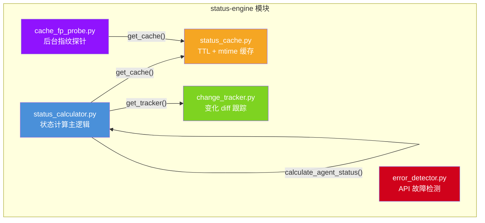
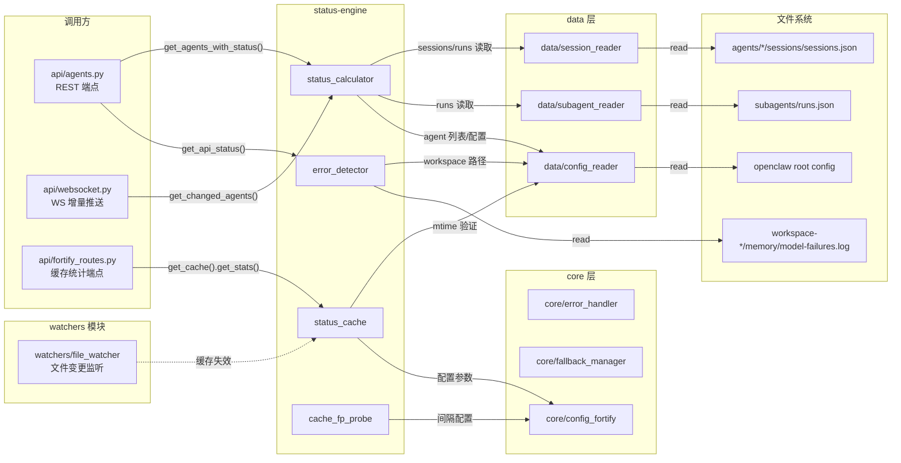

# status-engine 模块解剖报告

> 解剖日期: 2026-05-28 | SA: architect-agent
> 模块范围: `src/backend/status/` (6 files)

---

## 1. 模块概述

### 1.1 定位与职责

`status-engine` 是 Dashboard 后端的核心状态计算引擎，负责**实时感知 OpenClaw Agent 集群的运行状态**并将其格式化为前端可消费的结构。它向上为 WebSocket 增量推送和 REST API 提供数据，向下直接读取 OpenClaw 文件系统的 `sessions.json`、`runs.json`、`model-failures.log` 等原始数据源。

### 1.2 文件清单

| 文件 | 行数(估) | 核心职责 |
|------|---------|---------|
| `status_calculator.py` | ~320 | 状态计算主逻辑（idle/working/down 判定、任务提取、增量推送） |
| `status_cache.py` | ~230 | TTL + mtime 双验证缓存（内存保护、降级读、统计） |
| `change_tracker.py` | ~110 | 状态变化跟踪器（增量推送 diff 检测） |
| `error_detector.py` | ~120 | API 故障日志解析（model-failures.log → 按模型聚合健康度） |
| `cache_fp_probe.py` | ~35 | 后台守护线程：周期性 mtime 指纹探针清理缓存 |
| `__init__.py` | 1 | 模块标识（空） |

### 1.3 技术特征

- **运行时**: Python 3.9+, 基于 FastAPI 后端进程内运行
- **线程模型**: 多线程（threading.Lock），无 asyncio 协程（除 `get_changed_agents` 声明为 async 但内部无 await）
- **数据源**: 纯文件 I/O（JSON），无数据库
- **缓存策略**: 内存缓存 + TTL + mtime 指纹双验证 + 后台探针补强
- **外部依赖**: `psutil`（可选）、`watchdog`（通过 file_watcher 间接）

---

## 2. 逐文件分析

### 2.1 `status_calculator.py` — 状态计算器

#### 核心职责
计算单个/全部 Agent 的状态（idle / working / down），提取当前任务和活跃时间，支持增量变化检测。

#### 关键函数

| 函数 | 职责 | I/O 操作 |
|------|------|---------|
| `calculate_agent_status(agent_id)` | 状态判定的主入口。优先级: down → working → idle | 读 cache → 读 sessions.json/runs.json (通过 data 层) |
| `_has_recent_error_run(agent_id)` | 检查 runs.json 中最近 5 分钟有无 error run（补充 session 级别 error 检测） | `get_agent_runs()` → 文件 I/O |
| `_main_agent_solo_processing(agent_id)` | 主 Agent 无 run 时的兜底"working"判定（thinking 块、未完成 tool 调用、短窗内会话写入） | 多次 `session_reader` 调用 |
| `get_agents_with_status()` | 遍历全部 Agent，计算完整状态卡片 | 串行遍历，每个 Agent 3-5 次文件 I/O |
| `get_current_task(agent_id)` | 提取当前任务描述（活跃 run → 最近结束 run） | `get_agent_runs(limit=40)` |
| `get_last_active_time(agent_id)` | 取 runs + sessions 的 updatedAt 最大值 | 2 次文件读取 |
| `get_detailed_status(agent_id)` | 计算细粒度子状态（thinking / tool_executing / waiting_child / waiting_llm） | 多次 data 层调用 + 遍历 active runs |
| `get_display_status(agent_id)` | 面向前端的显示状态（带时间阈值防闪烁） | 同上 + `get_session_updated_at` |
| `get_changed_agents()` | 增量推送：计算全部 Agent 状态并与上次快照 diff | 全量遍历 + ChangeTracker diff |

#### 数据流
```
sessions.json ──┐
runs.json ──────┼──→ data.session_reader / data.subagent_reader ──→ calculate_agent_status()
                  │                                                    ├── cache.get/set
                  └──→ data.config_reader ────────────────────────────└── return AgentStatus
```

#### 依赖关系
- **内部**: `status_cache.get_cache()`, `change_tracker.get_tracker()`
- **data 层**: `config_reader`, `subagent_reader`, `session_reader`
- **core 层**: `error_handler`, `fallback_manager`
- **`[CROSS_MODULE_DEPENDENCY]`**: `data/session_reader`, `data/subagent_reader`, `data/config_reader`, `core/error_handler`, `core/fallback_manager`

#### 性能热点

1. **`get_agents_with_status()` 串行遍历**: 每个 Agent 独立触发 `calculate_agent_status()` + `get_current_task()` + `get_last_active_time()` + `get_last_error()`，合计 **4-6 次文件 I/O × N 个 Agent**。N=10 时为 40-60 次文件读取/秒级轮询。
2. **`get_current_task()` 的 `limit=40`**: 每次调用加载最近 40 条 run 记录，远超实际需要（仅需最近 1-2 条活跃/已结束 run）。
3. **`_main_agent_solo_processing()` 多次调用**: 内部调用 `has_thinking_block` + `get_pending_tool_call_with_timestamp` + `is_session_updated_within_seconds`，每次都是独立的文件读取。
4. **`get_changed_agents()` async 伪异步**: 声明为 `async def` 但内部无任何 `await`，实际上是**同步阻塞**。

---

### 2.2 `status_cache.py` — 状态缓存

#### 核心职责
为状态计算结果提供**内存级 TTL 缓存**，附带 mtime 指纹双验证机制防止脏数据，具备内存保护（容量 + RSS 估算上限）。

#### 关键函数/方法

| 方法 | 职责 | I/O 操作 |
|------|------|---------|
| `StatusCache.get(agent_id)` | 查缓存：TTL 检查 → mtime 双验证 → 命中返回 | 可能触发 `source_mtimes_for_agent_cache()` → 2 次 `stat()` |
| `StatusCache.set(agent_id, data)` | 写缓存：内存保护 → LRU 淘汰 → 存储 | `source_mtimes_for_agent_cache()` → 2 次 `stat()` (双验证开启时) |
| `StatusCache.get_stale_fallback(agent_id)` | 降级读：忽略 TTL/mtime，返回缓存中残留数据 | 无 I/O |
| `StatusCache.invalidate_stale_fp_entries()` | 后台探针：逐条比对 mtime 指纹并剔除过期条目 | 每条 2 次 `stat()` |
| `source_mtimes_for_agent_cache(agent_id)` | 获取缓存验证用的源文件 mtime（sessions.json + runs.json） | 2 次 `Path.stat()` |
| `get_cache()` | 全局单例工厂 | 读环境变量（首次） |

#### 数据流
```
set() ──→ 计算 mtime 指纹 ──→ {data, _timestamp, _fp, _est_bytes} ──→ _cache[agent_id]
                                                                    │
get() ──→ TTL 检查 ──→ mtime 双验证 ──→ 命中 ──→ 剥离内部字段 ──→ 返回
                   │                                    │
                   └─ miss ──→ 返回 None               └─ fp 不一致 ──→ 删除 + miss
```

#### 依赖关系
- **`[CROSS_MODULE_DEPENDENCY]`**: `core/config_fortify.get_fortify_config()`（读取双验证开关、TTL、容量参数）
- **`[CROSS_MODULE_DEPENDENCY]`**: `data/config_reader.get_openclaw_root()`, `data/config_reader.normalize_openclaw_agent_id()`（路径计算）
- **可选**: `psutil`（RSS 统计）

#### 性能热点

1. **每次 `get()/set()` 可能触发 2 次 `stat()`**: mtime 双验证开启时（默认开启），每次缓存读写都额外产生 2 次 `stat()` 系统调用。在 1 秒 TTL + 高频轮询场景下，`stat()` 调用频率可能与缓存命中率相当。
2. **`_enforce_memory()` 循环淘汰**: 当内存超限时，while 循环逐条淘汰直到低于阈值。极端情况下可能连续淘汰多条，持锁时间较长。
3. **`invalidate_stale_fp_entries()` 全量扫描**: 后台探针遍历全部缓存条目，每条独立获取锁 → 读 → 放锁 → stat() → 再次获取锁。N 条缓存产生 2N 次 stat() + 2N 次锁竞争。

---

### 2.3 `change_tracker.py` — 变化跟踪器

#### 核心职责
记录每个 Agent 的上次状态快照，比较新旧状态判定是否变化，用于 WebSocket 增量推送（只推送变化的 Agent）。

#### 关键方法

| 方法 | 职责 |
|------|------|
| `update(agent_id, new_state)` | 比较 status / currentTask / lastActiveAt / error 四字段，返回是否变化 |
| `get_changed_agents()` | 获取本轮变化的 Agent ID 列表 |
| `clear_changes()` | 清除变化标记（每轮推送后调用） |
| `get_last_state(agent_id)` | 获取上次快照（调试/恢复用） |

#### 数据流
```
calculate_agent_status() ──→ tracker.update(agent_id, state) ──→ bool changed
                                                               │
get_changed_agents() ───────→ [agent_ids] ────────────────────→ clear_changes()
```

#### 依赖关系
- **无外部依赖**（纯内存操作）
- 仅被 `status_calculator.py` 的 `get_changed_agents()` 调用

#### 性能热点

1. **MAX_SNAPSHOTS = 10 的清理逻辑过于保守**: 当 Agent 数量 > 10 时（多 Agent 场景完全可能），每次 `update()` 都会触发排序和重建 dict。实际上快照数应等于 Agent 数而非固定 10。**这是一个潜在的逻辑缺陷**——如果系统有 15 个 Agent，第 11 个 Agent 的旧状态会被错误清理。
2. **`update()` 中的 `new_state.copy()`**: 每次 update 都深拷贝整个状态字典，开销不大但属于无谓分配。

---

### 2.4 `error_detector.py` — API 故障检测器

#### 核心职责
解析 `model-failures.log` 文件，按模型聚合错误统计，输出 API 健康状态。

#### 关键函数

| 函数 | 职责 | I/O 操作 |
|------|------|---------|
| `parse_failure_log()` | 读取所有 workspace 的 model-failures.log 并解析 | 全量文件读取 × N 个 workspace |
| `get_api_status()` | 按模型聚合，5 分钟内有错误则标记 degraded | 依赖 `parse_failure_log()` |
| `_get_failure_log_paths()` | 收集所有 workspace 的日志路径 | 多次 `Path.exists()` |
| `extract_timestamp/model/error_type/message()` | 正则提取日志字段 | 无 I/O（纯字符串操作） |

#### 数据流
```
workspace-*/memory/model-failures.log ──→ parse_failure_log() ──→ entries[]
                                                                      │
get_api_status() ──→ 按模型分组 ──→ 5分钟窗口判定 ──→ [{model, status, errorCount}]
```

#### 依赖关系
- **`[CROSS_MODULE_DEPENDENCY]`**: `data/config_reader.get_workspace_paths()`, `data/config_reader.get_openclaw_root()`

#### 性能热点

1. **全量日志解析**: `parse_failure_log()` 每次调用都全量读取并解析所有 `model-failures.log`。日志文件可能随时间增长至数十 KB 甚至更大。在每次 API 轮询时重复解析是浪费。
2. **正则效率**: `extract_model()` 使用 `(glm-\d+(\.\d+)?|qwen\S*)` 硬编码模型名称模式，新增模型需修改代码。
3. **`except:` 裸异常捕获**: `extract_timestamp()` 中 `except: pass` 吞掉所有异常，不利于调试。
4. **`parse_failure_log()` 无缓存**: 与 `status_calculator` 的缓存机制完全独立，没有共享缓存策略。

---

### 2.5 `cache_fp_probe.py` — 缓存指纹探针

#### 核心职责
启动可选的后台守护线程，周期性调用 `StatusCache.invalidate_stale_fp_entries()` 进行 mtime 指纹验证，清理 TTL 内但因文件变化而过期的缓存条目。

#### 关键函数

| 函数 | 职责 |
|------|------|
| `start_cache_fp_probe_background()` | 根据配置决定是否启动守护线程，返回 stop Event |

#### 数据流
```
FortifyConfig.cache_fp_probe_interval_sec > 0
        │
        ▼
daemon thread ──→ sleep(interval) ──→ cache.invalidate_stale_fp_entries() ──→ 循环
```

#### 依赖关系
- **`[CROSS_MODULE_DEPENDENCY]`**: `core/config_fortify.get_fortify_config()`
- **`[CROSS_MODULE_DEPENDENCY]`**: `status.status_cache.get_cache()`
- **`[CROSS_MODULE_DEPENDENCY]`**: `core.error_handler.record_error()`

#### 性能热点

1. **探针间隔由环境变量控制**: 默认 `0.0`（禁用），启用时最小粒度取决于浮点精度，无下限保护。
2. **线程安全**: 使用 `threading.Event` + daemon thread，生命周期管理清晰。

---

### 2.6 `__init__.py`

- 仅包含注释 `# Status modules`，无导出逻辑。模块通过 `from status.xxx import yyy` 显式导入。

---

## 3. 数据流拓扑

### 3.1 模块内调用关系



### 3.2 与外部模块的交互



### 3.3 关键数据流路径

**路径 A — 全量状态查询** (REST API 轮询):
```
api/agents.py → get_agents_with_status()
    → for each agent:
        → calculate_agent_status()     [缓存读/计算]
            → cache.get()             [TTL + mtime 检查]
            → has_recent_errors()     [sessions.json]
            → _has_recent_error_run() [runs.json]
            → is_agent_working()      [runs.json]
            → _main_agent_solo_processing() [sessions.json 多次]
        → get_current_task()          [runs.json limit=40]
        → get_last_active_time()      [sessions.json + runs.json]
        → get_last_error()            [sessions.json, 仅 down 时]
    → return [{id, name, status, currentTask, lastActiveAt, error}]
```

**路径 B — 增量状态推送** (WebSocket):
```
api/websocket.py → get_changed_agents()
    → for each agent:
        → calculate_agent_status()    [同路径 A]
        → get_current_task()
        → get_last_active_time()
    → tracker.update()               [diff 检测]
    → tracker.clear_changes()
    → return [changed_agents only]
```

---

## 4. 问题与瓶颈

### 4.1 🔴 高优先级

| # | 问题 | 影响 | 位置 |
|---|------|------|------|
| H1 | **串行文件 I/O 瓶颈**: `get_agents_with_status()` 对 N 个 Agent 串行执行 4-6 次文件 I/O，N=10 时 40-60 次/轮。1 秒轮询间隔下，每秒数十次文件读取。 | CPU + I/O 浪费，延迟随 Agent 数线性增长 | `status_calculator.py: get_agents_with_status()` |
| H2 | **`get_changed_agents()` 伪异步**: 声明 `async def` 但无任何 `await`，在 asyncio 事件循环中**阻塞整个线程**。 | WebSocket 推送期间阻塞所有并发请求 | `status_calculator.py: get_changed_agents()` |
| H3 | **ChangeTracker.MAX_SNAPSHOTS=10 逻辑缺陷**: Agent 数 > 10 时，早期 Agent 的状态快照会被错误清理，导致增量 diff 检测产生**假变化**（每次都报告所有 Agent 变化）。 | 增量推送退化为全量推送，失去 diff 意义 | `change_tracker.py: ChangeTracker.update()` |

### 4.2 🟡 中优先级

| # | 问题 | 影响 | 位置 |
|---|------|------|------|
| M1 | **`get_current_task(limit=40)` 过度加载**: 每次调用加载 40 条 run 记录，实际仅需最近 1-2 条。 | 内存 + 解析浪费 | `status_calculator.py: get_current_task()` |
| M2 | **mtime 双验证 `stat()` 风暴**: 默认开启双验证时，每次缓存 get/set 触发 2 次 `stat()`。后台探针额外对全部缓存条目做 2N 次 `stat()`。 | 系统调用频率过高 | `status_cache.py: get()/set()/invalidate_stale_fp_entries()` |
| M3 | **`error_detector` 全量日志解析无缓存**: 每次调用全量读取并解析所有 `model-failures.log`。 | 重复 I/O + 解析开销 | `error_detector.py: parse_failure_log()` |
| M4 | **硬编码模型正则**: `extract_model()` 只识别 `glm-*` 和 `qwen*`，新增模型需改代码。 | 可维护性差 | `error_detector.py: extract_model()` |
| M5 | **裸 `except: pass`**: `extract_timestamp()` 中吞掉所有异常。 | 调试困难 | `error_detector.py: extract_timestamp()` |

### 4.3 🟢 低优先级

| # | 问题 | 影响 | 位置 |
|---|------|------|------|
| L1 | **`_main_agent_solo_processing()` 重复调用**: 在 `calculate_agent_status()` 和 `get_display_status()` 中可能被重复调用。 | 冗余 I/O | `status_calculator.py` |
| L2 | **`new_state.copy()` 无谓拷贝**: ChangeTracker.update 每次深拷贝。 | 微小内存开销 | `change_tracker.py` |
| L3 | **`__init__.py` 空导出**: 无公共 API 聚合，调用方需知道具体子模块。 | 模块边界不清晰 | `__init__.py` |

---

## 5. 对方案C的适配分析

> **前提声明**: 本次解剖未读取"方案C"的 PRD 或设计文档。以下分析基于 SA 对"StateStore"概念（集中式状态存储层替代分散文件读取）的通用理解进行适配评估。**[AMBIGUITY]** 缺少方案C的具体需求定义，以下为基于架构经验的推测性分析，需 PM 确认后才能作为正式设计依据。

### 5.1 可被 StateStore 替代的组件

| 组件 | 替代方式 | 理由 |
|------|---------|------|
| **`status_cache.py` (StatusCache)** | **完全替代** — StateStore 本身即为带 TTL 的一致性状态存储，StatusCache 的 TTL + mtime 双验证逻辑可由 StateStore 统一管理 | StateStore 若提供 mtime 感知的缓存能力，StatusCache 即为冗余层 |
| **`cache_fp_probe.py` (后台探针)** | **完全替代** — 探针的存在正是因为 StatusCache 无法感知文件变化。若 StateStore 通过 file_watcher 集成实现事件驱动失效，则探针不再需要 | 探针是 StatusCache 的补丁机制，根因消除后补丁随之消除 |
| **`change_tracker.py` (ChangeTracker)** | **部分替代** — StateStore 若提供 diff-on-write 能力（写入时自动检测变化），则 ChangeTracker 的 diff 逻辑可内化到 StateStore | 若 StateStore 不提供 diff 能力，则 ChangeTracker 需保留但可简化 |

### 5.2 应保留为独立组件的逻辑

| 组件 | 保留理由 | 与 StateStore 的关系 |
|------|---------|---------------------|
| **`status_calculator.py` — 状态判定规则** | **必须保留** — 状态计算包含复杂的业务规则（主 Agent 兜底、error run 窗口、子状态分类），这些是领域逻辑而非数据访问逻辑 | 从 StateStore 读取数据，但判定逻辑不变 |
| **`error_detector.py` — 故障日志解析** | **建议保留** — 独立的数据源（model-failures.log）和独立的解析逻辑，与 Agent 状态计算正交 | 可选择性地将其输出写入 StateStore，但解析器本身保留 |
| **`change_tracker.py` — diff 检测** | **条件保留** — 若 StateStore 不支持 diff-on-write，需保留。但其 API 应适配为 StateStore 的事件订阅者 | 作为 StateStore 的事件消费者 |

### 5.3 适配改造建议（待方案C PRD 确认后细化）

1. **数据访问层解耦**: `status_calculator.py` 当前直接调用 `data/session_reader` 和 `data/subagent_reader` 进行文件 I/O。适配 StateStore 后，应通过 StateStore 的查询接口获取数据，消除 calculator 对文件路径的感知。
2. **缓存策略统一**: `StatusCache` + `cache_fp_probe` → StateStore 内建缓存。`status_calculator.py` 中的 `use_cache` 参数语义变化：从"是否使用本地缓存"变为"是否接受 StateStore 的缓存数据"。
3. **事件驱动替代轮询**: 当前 WebSocket 增量推送依赖轮询 `get_changed_agents()`。StateStore + file_watcher 集成后，应改为事件驱动：file_watcher 检测文件变化 → 通知 StateStore → StateStore 触发状态重算 → 推送变化。
4. **`get_changed_agents()` 真正异步化**: 无论是否引入 StateStore，都应将文件 I/O 放入线程池或使用 `asyncio.to_thread()` 包装，避免阻塞事件循环。

### 5.4 迁移风险

| 风险 | 描述 | 缓解措施 |
|------|------|---------|
| **数据一致性窗口**: StateStore 引入后，文件变化到状态更新的延迟可能增大（取决于 StateStore 的更新机制） | 保留 StatusCache 的 mtime 双验证作为 StateStore 的一致性校验 |
| **降级路径缺失**: 若 StateStore 故障，当前无降级到直接文件读取的回退 | 保留 `data/session_reader` 作为降级数据源 |
| **ChangeTracker 状态丢失**: ChangeTracker 是纯内存的，StateStore 迁移过程中若重启服务，增量推送的 diff 基线会丢失 | StateStore 应持久化上次状态快照，或在重启时触发一次全量推送 |

---

## 附录: 外部依赖汇总

| 外部模块 | 被依赖方 | 使用方式 |
|---------|---------|---------|
| `data/config_reader` | status_calculator, status_cache, error_detector | 读取 agent 配置、workspace 路径、openclaw root |
| `data/session_reader` | status_calculator | 读取 session 级状态（errors, thinking, tool calls, updatedAt） |
| `data/subagent_reader` | status_calculator | 读取 runs 数据（active runs, waiting child） |
| `core/config_fortify` | status_cache, cache_fp_probe | 读取缓存配置参数（TTL, 容量, 双验证开关） |
| `core/error_handler` | status_calculator, cache_fp_probe | 异常分类与记录 |
| `core/fallback_manager` | status_calculator | I/O 异常降级处理 |
| `watchers/file_watcher` | (间接) status_cache | 文件变更触发缓存失效 `[CROSS_MODULE_DEPENDENCY]` |
